# Messers Cardio Club - Klassendiagramm

Dieses Diagramm zeigt die MVP-Struktur auf Modulebene: Screens, gemeinsame UI-Bausteine, Contexts, Services, Business-Logik und Supabase/PostgreSQL-Entitaeten.

```mermaid
classDiagram
direction LR

class AuthScreen {
  +loginWithPhoneAndPin()
  +registerWithInviteCode()
  +verifySmsCode()
  +resetForgottenPin()
}

class EventScreen {
  +loadCurrentEvent()
  +setAttendance()
  +voteForSports()
  +showDecision()
}

class ChatScreen {
  +loadMessages()
  +sendMessage()
}

class MembersScreen {
  +listMembers()
  +openMemberProfile()
}

class MenuScreen {
  +showNotifications()
  +navigateToSubmenus()
  +toggleTheme()
}

class AdminScreen {
  +manageMembers()
  +manageSports()
  +manageSportContacts()
  +reviewNameRequests()
  +reviewSportIdeas()
}

class ProfileScreen {
  +editProfile()
  +requestNameChange()
  +changePhone()
  +changePin()
}

class IdeasScreen {
  +submitSportIdea()
  +listPendingIdeas()
  +reviewIdea()
}

class InvitesScreen {
  +createInviteCode()
  +shareInviteCode()
  +listInviteCodes()
}

class PushScreen {
  +requestPushPermission()
  +savePushToken()
}

class AuthContext {
  +user
  +session
  +signOut()
}

class ThemeContext {
  +theme
  +mode
  +toggleTheme()
}

class SharedUI {
  +PageHeader
  +BottomNav
  +ThemeToggle
  +BrandBackground
  +AuthIntro
  +Motion
}

class SupabaseClient {
  +auth
  +database
  +storage
}

class ClubsService {
  +createClub()
  +joinClub()
  +getClubs()
}

class EventsService {
  +createWeeklyEvent()
  +getCurrentWeeklyEvent()
  +getMccEventState()
}

class AttendanceService {
  +updateAttendance()
  +listAttendance()
}

class VotesService {
  +voteForSport()
  +removeVote()
}

class ProposalsService {
  +proposeSport()
  +listProposals()
}

class DecisionsService {
  +getEventDecisionPreview()
  +finalizeEventDecision()
  +createSubgroupsFromDecision()
}

class InvitationsService {
  +validateInvitationCode()
  +consumeInvitationCode()
  +createInvitationCode()
  +listInvitationCodes()
}

class ProfilesService {
  +ensureProfile()
  +updateProfileDetails()
  +requestDisplayNameChange()
}

class MembersService {
  +listMccMembers()
}

class ChatService {
  +listChatMessages()
  +sendChatMessage()
}

class SportIdeasService {
  +suggestSportIdea()
  +listSportIdeas()
  +reviewSportIdea()
}

class AdminPanelService {
  +updateMccMemberRole()
  +deactivateMccMember()
  +upsertMccSport()
  +deleteMccSport()
  +upsertMccSportContact()
}

class PushService {
  +registerPushToken()
}

class FairSportSelection {
  +selectFairSport()
  +scoreVotes()
  +explainDecision()
}

class SportCompatibility {
  +canCombineSports()
}

class VotingRules {
  +rankVoteWeight()
  +validateVoteLimit()
}

class VotingEligibility {
  +canUserVote()
}

class DecisionPresentation {
  +buildDecisionSummary()
}

class Profile {
  +uuid id
  +string display_name
  +string phone
  +string city
  +date birth_date
  +string[] favorite_sports
  +timestamp deactivated_at
}

class Club {
  +uuid id
  +string name
  +uuid created_by
}

class ClubMember {
  +uuid id
  +uuid club_id
  +uuid user_id
  +role member|mod|admin
}

class Sport {
  +uuid id
  +string name
  +string description
  +string location_description
  +string category
  +intensity low|medium|high
  +locationType indoor|outdoor|water|field|flexible
}

class WeeklyEvent {
  +uuid id
  +uuid club_id
  +date week_start_date
  +uuid selected_sport_id
  +uuid secondary_sport_id
  +status proposing|voting|decided|completed|cancelled
}

class SportProposal {
  +uuid id
  +uuid event_id
  +uuid sport_id
  +uuid proposed_by
}

class SportVote {
  +uuid id
  +uuid event_id
  +uuid sport_id
  +uuid user_id
  +number weight
}

class Attendance {
  +uuid id
  +uuid event_id
  +uuid user_id
  +status going|maybe|not_going
  +uuid subgroup_id
}

class EventSubgroup {
  +uuid id
  +uuid event_id
  +uuid sport_id
}

class ChatMessage {
  +uuid id
  +uuid event_id
  +uuid user_id
  +string body
}

class InvitationCode {
  +uuid id
  +string code
  +uuid created_by
  +uuid used_by
  +timestamp used_at
}

class SportIdea {
  +uuid id
  +string name
  +string note
  +string location
  +string preferred_time
  +status pending|approved|rejected
}

class SportContact {
  +uuid id
  +uuid sport_id
  +uuid user_id
  +boolean is_primary
}

class ProfileChangeRequest {
  +uuid id
  +uuid user_id
  +string requested_display_name
  +status pending|approved|rejected
}

AuthScreen --> AuthContext
AuthScreen --> SupabaseClient
AuthScreen --> InvitationsService
AuthScreen --> ProfilesService
AuthScreen --> SharedUI

EventScreen --> EventsService
EventScreen --> AttendanceService
EventScreen --> VotesService
EventScreen --> DecisionsService
EventScreen --> SharedUI

ChatScreen --> ChatService
MembersScreen --> MembersService
MenuScreen --> AuthContext
MenuScreen --> ThemeContext
MenuScreen --> SharedUI
AdminScreen --> AdminPanelService
AdminScreen --> MembersService
AdminScreen --> SportIdeasService
ProfileScreen --> ProfilesService
IdeasScreen --> SportIdeasService
InvitesScreen --> InvitationsService
PushScreen --> PushService

ClubsService --> SupabaseClient
EventsService --> SupabaseClient
AttendanceService --> SupabaseClient
VotesService --> SupabaseClient
ProposalsService --> SupabaseClient
DecisionsService --> SupabaseClient
InvitationsService --> SupabaseClient
ProfilesService --> SupabaseClient
MembersService --> SupabaseClient
ChatService --> SupabaseClient
SportIdeasService --> SupabaseClient
AdminPanelService --> SupabaseClient
PushService --> SupabaseClient

DecisionsService --> FairSportSelection
DecisionsService --> DecisionPresentation
FairSportSelection --> SportCompatibility
FairSportSelection --> VotingRules
FairSportSelection --> VotingEligibility

Club "1" --> "*" ClubMember
Profile "1" --> "*" ClubMember
Club "1" --> "*" WeeklyEvent
WeeklyEvent "1" --> "*" SportProposal
WeeklyEvent "1" --> "*" SportVote
WeeklyEvent "1" --> "*" Attendance
WeeklyEvent "1" --> "*" EventSubgroup
WeeklyEvent "1" --> "*" ChatMessage
Sport "1" --> "*" SportProposal
Sport "1" --> "*" SportVote
Sport "1" --> "*" SportContact
Sport "1" --> "*" SportIdea
Profile "1" --> "*" SportVote
Profile "1" --> "*" Attendance
Profile "1" --> "*" ChatMessage
Profile "1" --> "*" InvitationCode
Profile "1" --> "*" ProfileChangeRequest
```

