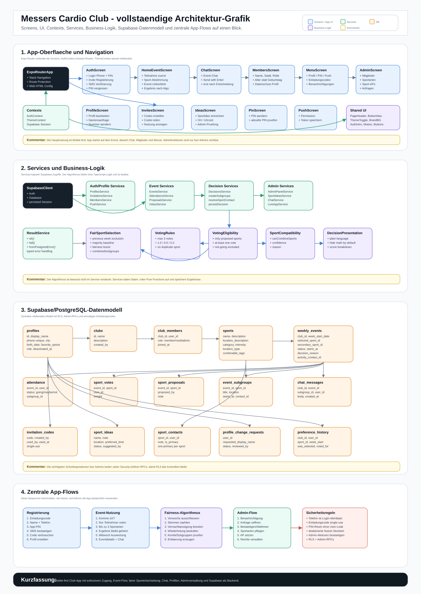
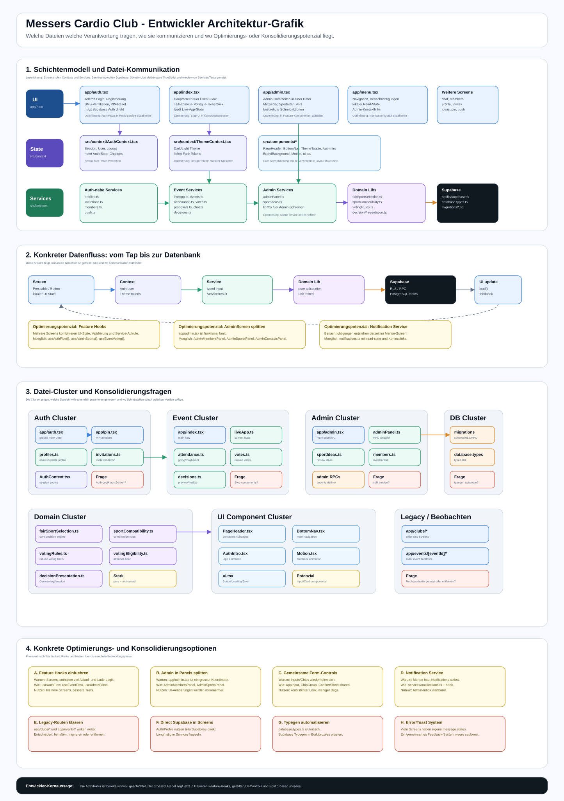
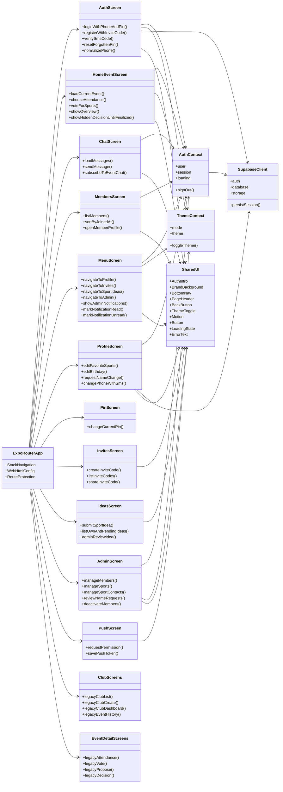
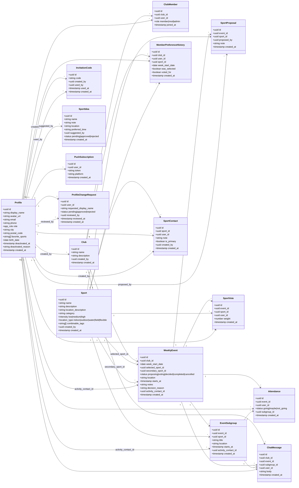
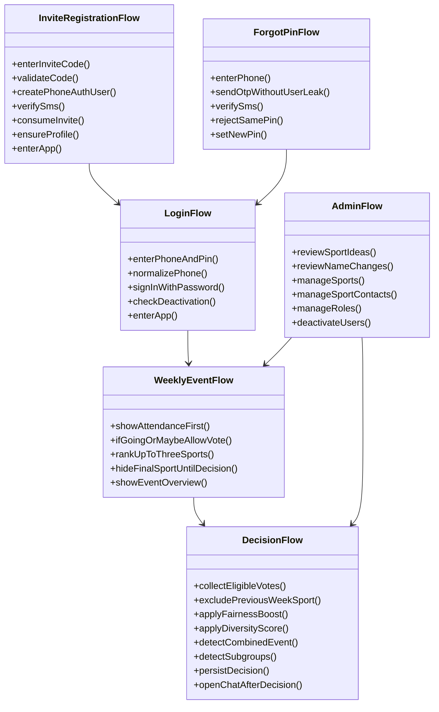
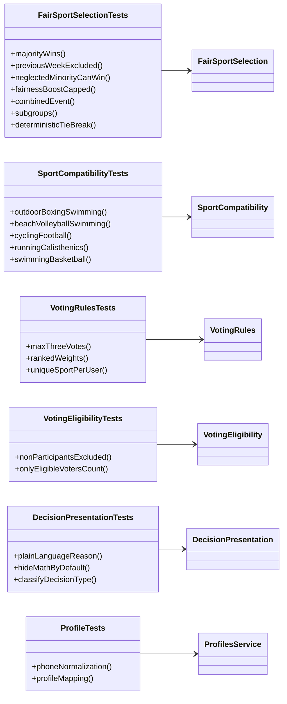

# Messers Cardio Club - vollstaendiges Klassendiagramm

Diese Datei gibt einen Gesamtueberblick ueber die App: Screens, UI-Komponenten, Contexts, Services, Business-Logik und Supabase/PostgreSQL-Datenmodell.

## Grafik

## Entwickler-Grafik

## 1. App-Architektur

## 2. Service- und Business-Logik

```mermaid
classDiagram
direction LR

class AppSupabaseClient {
  +from()
  +rpc()
  +auth()
}

class ResultService {
  +ok()
  +fail()
  +fromPostgrestError()
}

class ClubsService {
  +createClub()
  +joinClub()
  +listClubs()
}

class LiveAppService {
  +ensureMccWeek()
  +getLiveAppState()
}

class EventsService {
  +createWeeklyEvent()
  +getCurrentWeeklyEvent()
  +getEventHistory()
}

class AttendanceService {
  +updateAttendance()
  +listAttendance()
}

class ProposalsService {
  +proposeSport()
  +listSportProposals()
}

class VotesService {
  +voteForSport()
  +removeVote()
  +listVotes()
}

class DecisionsService {
  +getEventDecisionPreview()
  +finalizeEventDecision()
  +createSubgroupsFromDecision()
  +resolveSportContact()
}

class InvitationsService {
  +validateInvitationCode()
  +consumeInvitationCode()
  +createInvitationCode()
  +listInvitationCodes()
}

class ProfilesService {
  +ensureProfile()
  +normalizePhone()
  +updateProfileDetails()
  +requestDisplayNameChange()
}

class MembersService {
  +listMccMembers()
  +mapPublicMemberProfile()
}

class ChatService {
  +listChatMessages()
  +sendChatMessage()
}

class SportIdeasService {
  +suggestSportIdea()
  +listSportIdeas()
  +reviewSportIdea()
}

class AdminPanelService {
  +updateMccMemberRole()
  +deactivateMccMember()
  +listMccSports()
  +upsertMccSport()
  +deleteMccSport()
  +listMccSportContacts()
  +upsertMccSportContact()
  +deleteMccSportContact()
}

class PushService {
  +registerPushToken()
}

class DateService {
  +formatDate()
  +weekStartDate()
}

class VotingRules {
  +maxVotesPerUser()
  +rankToWeight()
  +validateVotingOpen()
}

class VotingEligibility {
  +mustAttendToVote()
  +excludeNonParticipants()
}

class SportCompatibility {
  +canCombineSports()
  +scoreCompatibility()
}

class FairSportSelection {
  +selectFairSport()
  +scoreSports()
  +applyPreviousWeekExclusion()
  +applyFairnessBoost()
  +recommendCombinedOrSubgroups()
}

class DecisionPresentation {
  +buildHumanExplanation()
  +classifyDecisionMode()
  +hideMathByDefault()
}

ClubsService --> AppSupabaseClient
LiveAppService --> AppSupabaseClient
EventsService --> AppSupabaseClient
AttendanceService --> AppSupabaseClient
ProposalsService --> AppSupabaseClient
VotesService --> AppSupabaseClient
DecisionsService --> AppSupabaseClient
InvitationsService --> AppSupabaseClient
ProfilesService --> AppSupabaseClient
MembersService --> AppSupabaseClient
ChatService --> AppSupabaseClient
SportIdeasService --> AppSupabaseClient
AdminPanelService --> AppSupabaseClient
PushService --> AppSupabaseClient

ClubsService --> ResultService
EventsService --> ResultService
AttendanceService --> ResultService
ProposalsService --> ResultService
VotesService --> ResultService
DecisionsService --> ResultService
InvitationsService --> ResultService
ProfilesService --> ResultService
MembersService --> ResultService
ChatService --> ResultService
SportIdeasService --> ResultService
AdminPanelService --> ResultService
PushService --> ResultService

DecisionsService --> FairSportSelection
DecisionsService --> DecisionPresentation
FairSportSelection --> VotingRules
FairSportSelection --> VotingEligibility
FairSportSelection --> SportCompatibility
FairSportSelection --> DecisionPresentation
EventsService --> DateService
```

## 3. Supabase/PostgreSQL-Datenmodell

## 4. Wichtige App-Flows

## 5. Testabdeckung

